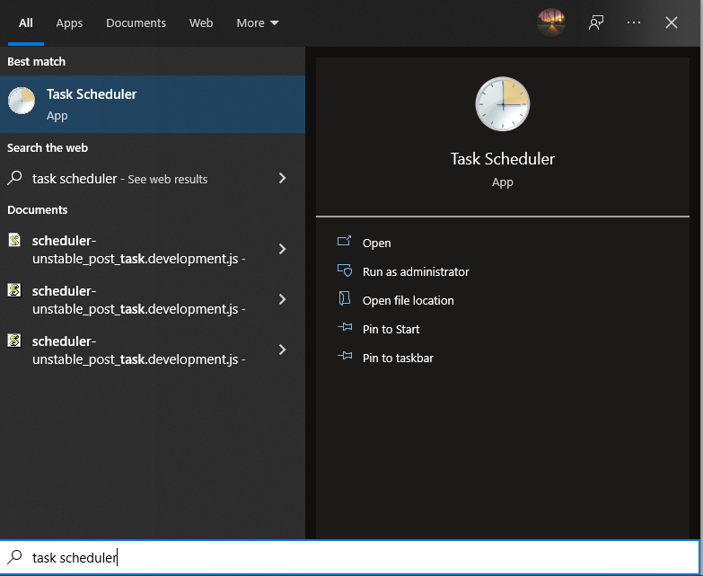

# Router Reboot

I made this python script to reboot my Huawei Router b612s-25d programmatically using Selenium.

### Setup:

```bash
git clone https://github.com/escaper01/router_reboot.git
```

Before installing the requirements, it’s better to create a virtual environment for the needed packages and activated it

```bash
virtualenv venv
./venv/Scripts/activate
pip install -r requirements.txt
```

to execute the script:

```bash
python bot.py
```

For my use case, my internet connection gets a slower during the night, so I have to reboot my router every time it happens as an edge solution 😎 I have made this script run every time using task scheduler under Windows OS (for Linux users CRON job would do the trick flawlessly).
Before setting up the task, we should create a BATCH script(Already in the repo).

```bash
CD C:\Users\escaper\OneDrive\Bureau\projects\RebootRouterBot
CALL .\venv\Scripts\activate
CALL python "bot.py"
```

The script is self-explanatory, now what’s left is the Task Scheduler:



Create Task:


As for the Triggers settings:


That would make the script executed every 30 minutes.


And the Action would to run the BATCH script (Set up the full path for the **script.bat)**

Once you hit **OK,** the script will run as scheduler.


